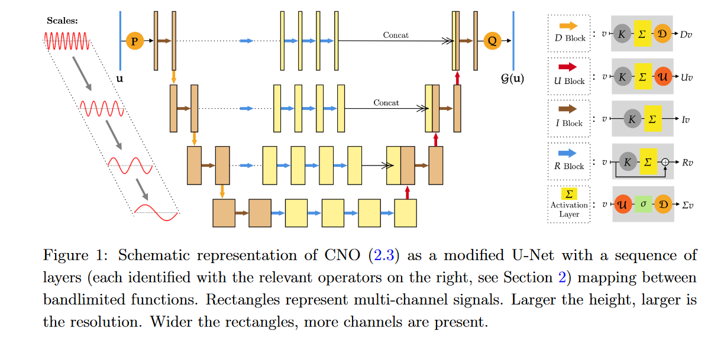

# Neural Operators and Operator Networks vs Parametric Approach

## Task 

1. a standard feed forward neural network to approximate the function $g$

$$
g(x,y,\mu ) = u(T, x, y, \mu )
$$

2. an operator network (DeepONet) or Neural Operator to approximate the operator $\mathcal G$

$$
G(u_0)(x,y) = u(T,x,y)
$$

## Equation

### Heat  Equation

#### PDE equation

$$
u_t = \nabla u\quad t \in [0,T],(x_1,x_2)\in [-1,1]^2, \mu\in [-1,1]^d
$$

$$
\mu\sim Unif([-1,1]^d)
$$

#### initial condition

$$
u(0,x_1,x_2,\mu) = -\frac{1}{d}\sum_{m=1}^d  \mu_m sin(\pi m x_1)sin(\pi m x_2)/\sqrt m
$$
#### boundary condition

$$
u(t,\\\{-1,1\\\},\\\{-1,1\\\},\mu) = 0
$$

#### solution 

$$
u(t,x_1,x_2,\mu) = -\frac{1}{d}\sum_{m=1}^d \frac{\mu_m}{\sqrt{m}} e^{-2m^2\pi^2t} sin(\pi m  x_1)sin(\pi mx_2)
$$

### Wave Equation

### Poisson Equation

## Model

### MLP

$$
H^{l+1} = \sigma(W H^l + b)
$$

### DeepONet

$$
\tilde u(T,x_1,x_2,\mu)_{jd} = \mathcal B\left([y_1,y_2,u(0,y_1,y_2,\mu)]\right)_{idh}\mathcal T([T,x_1,x_2])_{jdh}
$$

### FNO

$$
H^{l+1} = \sigma\left(Conv(H^l) + \mathcal F^{-1}\left(W(\mathcal F H^l)+b\right)\right)
$$

### CNO

## Result

### Heat Equation FFN

### Heat Equation DeepONet

### Heat Equation FNO

### Heat Equation CNO

## Discussion

### 20.06.2023

1. CNO [paper](https://arxiv.org/pdf/2302.01178.pdf) and code difference
2. more equations similar to CNO [paper](https://arxiv.org/pdf/2302.01178.pdf), make it similar to the task assignment considering $d$
   - Wave Equation
   - Poisson Equation
   - Navier  Stokes?
   - Transport Equation?
3. NN implementation correction
   1. make everyone knows how it works
   2. new neural operator?
   3. formula expression
   4. arguments control
4. result display
   1. what content we should display
   2. seperate them into groups
5. possible our new operator?
