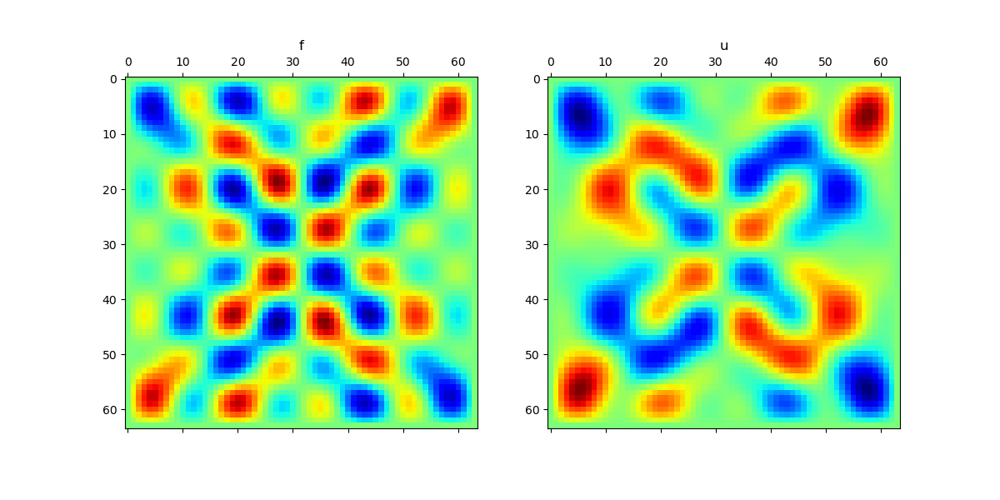
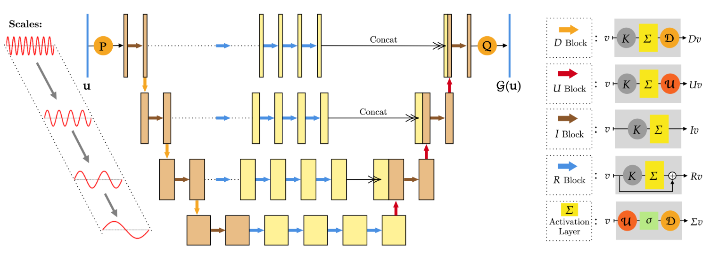
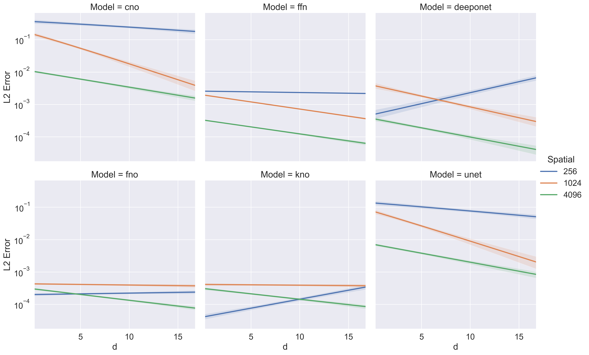
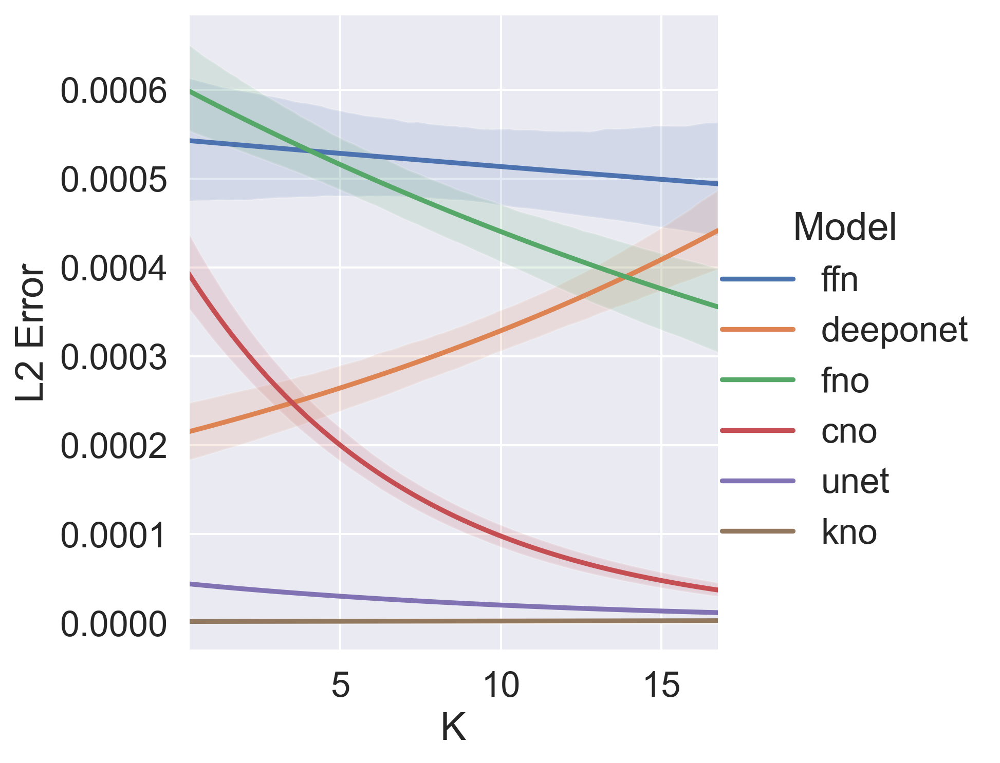
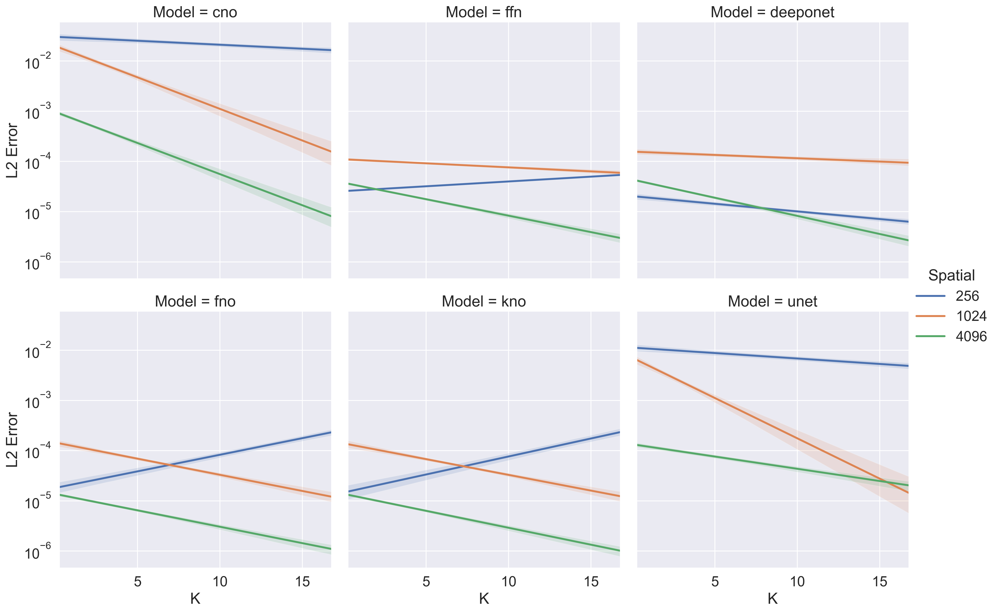

# Neural Operators and Operator Networks vs Parametric Approach

## Usage

The default configuration is inside the `add_arguments` function inside ``config.py`

### prerequisite

1. if you are using windows,
   install `visual studio` to default location
2. download the `ninja` and add it to path

### Look at how the equations evolve over tim
the command below will generate the evolution video from all equations under different parameters
```bash
python gen_video.py
```
the result is inside `videos/` folder

### generate your own configuration
by running the command below, it will generate folders of toml file based on the marco in `config.py`
and the availability of GPU and the memory you passed.
```bash
python gen_config.py
```

### run the trainig script
the training script is automatically restore from the last interrupt state, just run 
```bash
python run_train.py
```
every time you are available. And there will be total of $90$ weights.

Moreover, we provide our training weight here in the [release](https://github.com/walkerchi/DeepLearning-in-ScientificComputing-PartB/releases/tag/v1). You could download it and unzip to the `weights` folder.

### run the plotting script
after you have the weights folder. You run the plotting script to plot the images to the `images` folder just run
```bash
python run_plot.py
```

### <font color="red">(for developer)</font> run all the training files
by running this command, it will run recursively all the configuration file under the config folder

```bash
python run_folder.py config
```

### <font color="red">(for developer)</font> run with single configuration file

the file and be `toml/json/yaml` file

you simply give it after the argument of `run_file.py`

for example, if you want to train the deeponet on heat equation

```bash
python run_file.py config/train/heat_d=1/deeponet.toml
```

### <font color="red">(for developer)</font> run with command line

for example, if you want to train the deeponet on heat equation

```bash
python main.py --task train --model deeponet --equation heat
```

## Task 

1. a standard feed forward neural network to approximate the function $g$

$$
g(x,y,\mu) = u(T, x, y, \mu)
$$

2. an operator network (DeepONet) or Neural Operator to approximate the operator $\mathcal G$

$$
\mathcal G(u_0)(x,y) = u(T,x,y)
$$

We have the theoretical congruity and practical approximation

$$ 
g(x,y,\mu) = \mathcal G(u_0)(x,y) 
$$

and for each component

$$ 
g(x,y,\mu^{(j)}) = \mathcal G(u_0^{(j)})(x,y) 
$$

## Equation

### Heat  Equation


#### PDE equation

$$
u(t,x_1,x_2) = \Delta u 
$$

where 

$$
t \in [0,T],\quad(x_1,x_2)\in  [-1,1]^2
$$

$$
\mu\sim Unif([-1,1]^d)
$$


#### initial condition

$$
u(0,x_1,x_2,\mu) = -\frac{1}{d}\sum_{m=1}^d  \mu_m sin(\pi m x_1)sin(\pi m x_2)/\sqrt m
$$
#### boundary condition

$$
u(t, \pm 1, \pm 1) = 0
$$

#### solution 

$$
u(t,x_1,x_2,\mu) = -\frac{1}{d}\sum_{m=1}^d \frac{\mu_m}{\sqrt{m}} e^{-2m^2\pi^2t} sin(\pi m  x_1)sin(\pi mx_2)
$$

### Wave Equation


##### PDE Equation

$$ u_{tt} - c^2 \Delta u = 0 (u_{tt} - c^2(u_{xx} + u_{yy})) \quad (x, y) \in [0, 1]^2, t \in [0, T], c = 0.1 $$   

##### Initial Condition

$$u(0, x, y, a) = \frac{\pi}{K^2} \sum_{i,j=1}^{K} a_{ij} \cdot (i^2 + j^2)^{-r} sin(\pi ix) sin(\pi jy) \quad \forall x,y \in [0, 1]$$

$$ u(t, \pm 1, \pm 1) = 0$$

##### Solution

$$u(t, x, y, a) = \frac{\pi}{K^2} \sum_{i,j=1}^{K} a_{ij} \cdot (i^2 + j^2)^{-r} sin(\pi ix) sin(\pi jy) cos(c\pi t \sqrt{i^2 + j^2}), \forall x,y \in [0, 1]$$


### Poisson Equation




##### PDE Equation

$$ -\Delta u = -(u_{xx} + u_{yy}) = f \quad (x, y) \in [0, 1]^2 $$   

##### Boundary Condition

$$u\vert_{\partial D} = 0 $$

##### Solution

$$u(x, y) = \frac{1}{\pi\cdot K^2} \sum_{i,j=1}^{K} a_{ij} \cdot (i^2 + j^2)^{r-1} sin(\pi ix) sin(\pi jy),\quad \forall (x,y) \in D$$

with respect to source function

$$f=\frac{\pi}{K^2} \sum_{i,j=1}^{K} a_{ij} \cdot (i^2 + j^2)^{r} sin(\pi ix) sin(\pi jy),\quad \forall (x,y) \in D$$

## Model

### MLP

$$
H^{l+1} = \sigma(W H^l + b)
$$

### DeepONet

$$
\tilde u( T, x_1, x_2, \mu )_{jd} = 
\mathcal B \left( [ y_1, y_2, u ( 0, y_1, y_2, \mu ) ] \right) _ { idh } 
\mathcal T (  [ T, x_1, x_2 ] ) _ { jdh }
$$

### FNO

$$
H^{l+1} = \sigma\left(Conv(H^l) + \mathcal F^{-1}\left(W(\mathcal F H^l)+b^l\right)\right)
$$


### CNO




### KNO

$$
H^{l+1}  = \mathcal F^{-1}\left(W(\mathcal F H)+b\right)
$$


## Code Structure

- `equations`
  this is the directory to put all the equation conditions
  if you want to add new equation, you should do
  1. add a equation `.py` file here, and implement your equation as others
  2. import it from `equations\__init__.py`, and add the entrance to the lookup table
  3. change the equation choices in the `config.py`
   
- `models`
  this is the directory to put all the deep neural networks
  if you want to add new model, first you need to think about which type of trainer it should use.
  If none of the trainer satisfy your needs, you need to implement your own trainer 
  and do the routing in `main.py` and  `run_file.py`.
  If you want to add the a model using mesh neural operator trainer, here are some steps.
  1. add a model `.py` file here, and implement your model as other
  2. import it from `models\__init__.py`, and add the entrance to  the lookup table
  3. change the model choices in the `config.py`

- `trainer`
  this is the directory to put three kinds of trainer, they are
  - ffn trainer, which takes the form as $g(x,y,\mu ) = u(T, x, y, \mu )$.
    
  - DeepONet trainer, which takes the form as $G(u0)(x1,x2)$.
  
  - mesh neural operator trainer, which takes the form as $G(u0,x1,x2)$.
    They can only tackle the mesh sampling input

- `videos`
  this is a folder automatically generated by `gen_video.py`

- `images`
  this is a folder automatically generated by the code.
  It's used to save the image result.

- `weights`
  this is a folder automatically generated by the code or download from our release weights.
  It's used to save the weight of the model, normalizer and dataset generator.
  
- `config`
  this is folder to put all the configuration files (toml/json/yaml).
  It's generated by `gen_config.py`.

- `config.py`
  this is the python script to process the configuration from command line, file and key-word arguments.

- `main.py`
  this is the command line configuration running entrance.

- `gen_config.py`
  this will generate configuration files to the `config`folder 

- `gen_video.py`
  this will generate equation evolution video to the `videos` folder

- `run_file.py`
  this is the file configuration running entrace.

- `run_folder.py`
  this is the folder configuration running entrace.

- `run_train.py`
  this will run all the training configuration under `config` folder

- `run_plot.py`
  this will run all the predict and varying configuration under `config` folder

## Result

### Heat Equation




## Wave Equation




## Poisson Equation




## Discussion

### 20.06.2023

1. CNO [paper](https://arxiv.org/pdf/2302.01178.pdf) and code difference
2. more equations similar to CNO [paper](https://arxiv.org/pdf/2302.01178.pdf), make it similar to the task assignment considering $d$
   - Wave Equation
   - Poisson Equation
   - Navier  Stokes?
   - Transport Equation?
3. NN implementation correction
   1. make everyone knows how it works
   2. new neural operator?
   3. formula expression
   4. arguments control
4. result display
   1. what content we should display
      1. $d$ - error for different model distribution
      2. parameter sensitivity, parameter(sample density/sample engine) -  error (customize)
      3. NN architecture
      4. NN prediction - error
   2. seperate them into groups
5. possible our new operator?

### 01.07.2023

1. CNO smaller
2. every body run folder
   1. run folder 
   2. share weight  and run train
3. discuss  about  the  paper
   1. result part
   2. abstract, introduction and conclusion
   3. put some part to appendix (4 page at most)

### 08.07.2023

1. CNO bad result 
   1. potential bug 
   2. different setup from the paper
2. two versions of overleaf project
   1. first version finished
   2. second version for varying spatial
   
