# Neural Operators and Operator Networks vs Parametric Approach

## Usage

The default configuration is inside the `add_arguments` function inside ``config.py`

### prerequisite

1. if you are using windows,
   install visual studio to default location
2. download the ninja and add it to path

### run with single configuration file

the file and be `toml/json/yaml` file

you simply give it after the argument of `run_file.py`

for example, if you want to train the deeponet on heat equation

```bash
python run_file.py -c config/train/heat_d=1/deeponet.toml
```

### run with command line

for example, if you want to train the deeponet on heat equation

```bash
python main.py --task train --model deeponet --equation heat
```

## Task 

1. a standard feed forward neural network to approximate the function $g$

$$
g(x,y,\mu ) = u(T, x, y, \mu )
$$

2. an operator network (DeepONet) or Neural Operator to approximate the operator $\mathcal G$

$$
G(u_0)(x,y) = u(T,x,y)
$$

## Equation

### Heat  Equation

#### PDE equation

$$
u_t = \nabla u\quad t \in [0,T],(x_1,x_2)\in [-1,1]^2, \mu\in [-1,1]^d
$$

$$
\mu\sim Unif([-1,1]^d)
$$

#### initial condition

$$
u(0,x_1,x_2,\mu) = -\frac{1}{d}\sum_{m=1}^d  \mu_m sin(\pi m x_1)sin(\pi m x_2)/\sqrt m
$$
#### boundary condition

$$
u(t,\\\{-1,1\\\},\\\{-1,1\\\},\mu) = 0
$$

#### solution 

$$
u(t,x_1,x_2,\mu) = -\frac{1}{d}\sum_{m=1}^d \frac{\mu_m}{\sqrt{m}} e^{-2m^2\pi^2t} sin(\pi m  x_1)sin(\pi mx_2)
$$

### Wave Equation

##### PDE Equation

$$ u_{tt} - c^2 \Delta u = 0 (u_{tt} - c^2(u_{xx} + u_{yy})) \quad (x, y) \in [0, 1]^2, t \in [0, T], c = 0.1 $$   

##### Initial Condition

$$u(0, x, y, a) = \frac{\pi}{K^2} \sum_{i,j=1}^{K} a_{ij} \cdot (i^2 + j^2)^{-r} sin(\pi ix) sin(\pi jy) \quad \forall x,y \in [0, 1]$$

##### Solution

$$u(t, x, y, a) = \frac{\pi}{K^2} \sum_{i,j=1}^{K} a_{ij} \cdot (i^2 + j^2)^{-r} sin(\pi ix) sin(\pi jy) cos(c\pi t \sqrt{i^2 + j^2}), \forall x,y \in [0, 1]$$

### Poisson Equation

## Model

### MLP

$$
H^{l+1} = \sigma(W H^l + b)
$$

### DeepONet

$$
\tilde u( T, x_1, x_2, \mu )_{jd} = 
\mathcal B \left( [ y_1, y_2, u ( 0, y_1, y_2, \mu ) ] \right) _ { idh } 
\mathcal T (  [ T, x_1, x_2 ] ) _ { jdh }
$$

### FNO

$$
H^{l+1} = \sigma\left(Conv(H^l) + \mathcal F^{-1}\left(W(\mathcal F H^l)+b\right)\right)
$$


### CNO


## Result

### Heat Equation Prediction

$d=1$ and $T=1$

#### FFN

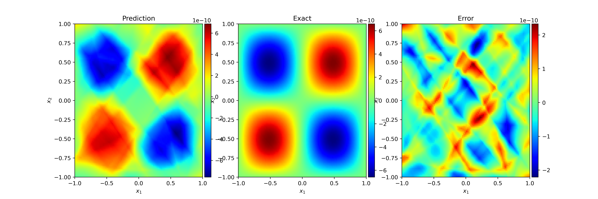

#### DeepONet

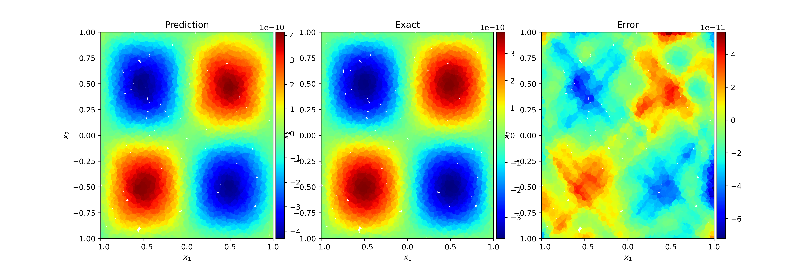

#### FNO

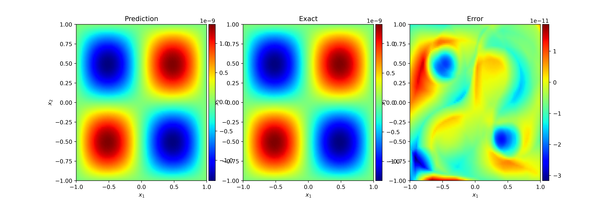

#### CNO

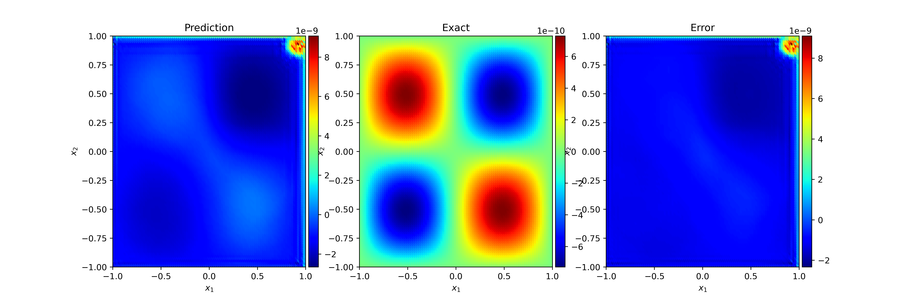

#### UNet

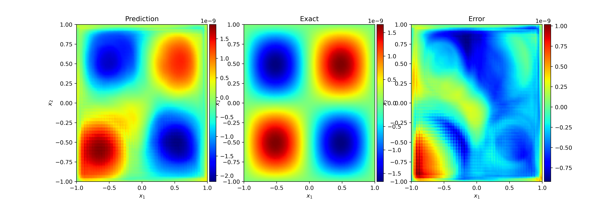

#### KNO

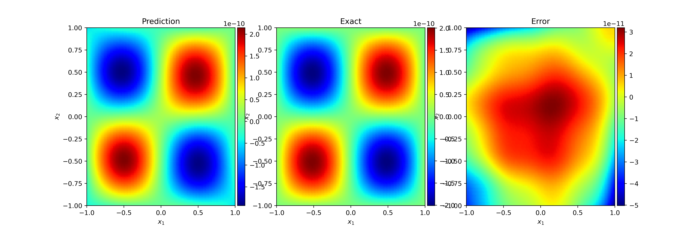


### Heat Equation Varying d

#### FFN


#### DeepONet

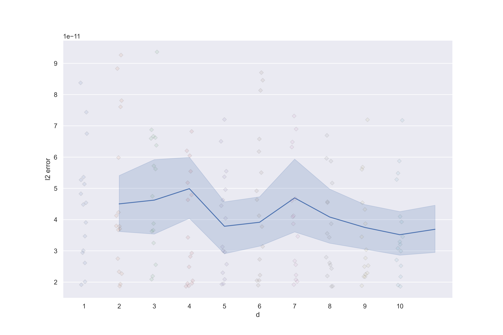

#### FNO


#### CNO


#### UNet


#### KNO


### Wave Equation Prediction

$K=1$ and $T=1$

#### FFN

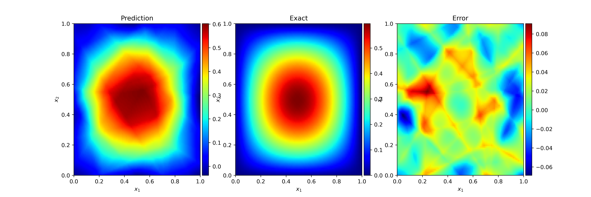

#### DeepONet

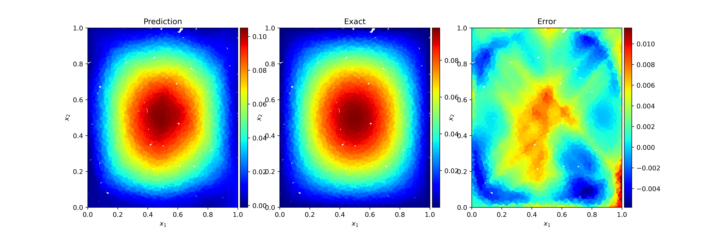

#### FNO

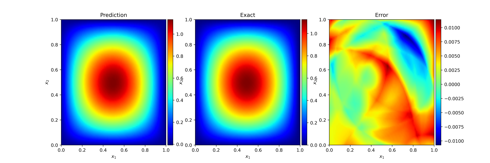

#### CNO


#### UNet

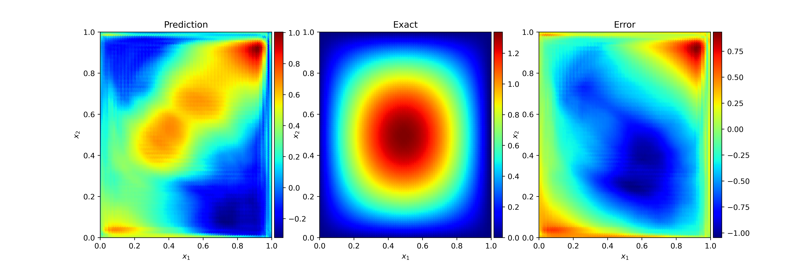

#### KNO

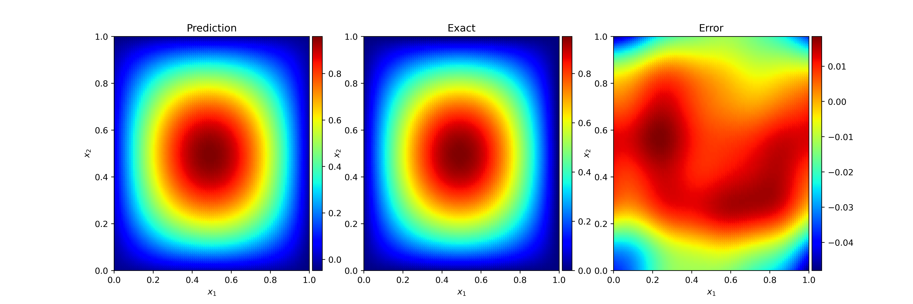


### Wave Equation Varying d

#### FFN

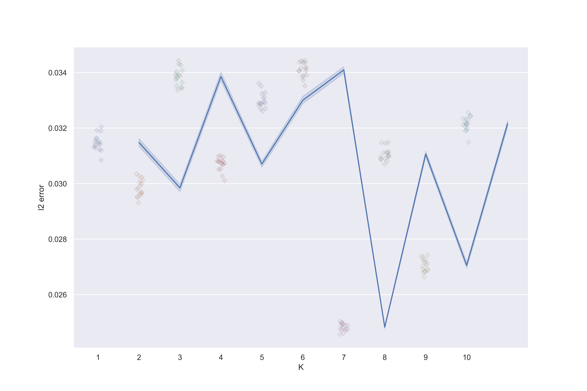

#### DeepONet


#### FNO


#### CNO


#### UNet


#### KNO


## Code Structure

- `equations`
  this is the directory to put all the equation conditions
  if you want to add new equation, you should do
  1. add a equation `.py` file here, and implement your equation as others
  2. import it from `equations\__init__.py`, and add the entrance to the lookup table
  3. change the equation choices in the `config.py`
- `models`
  this is the directory to put all the deep neural networks
  if you want to add new model, first you need to think about which type of trainer it should use.
  If none of the trainer satisfy your needs, you need to implement your own trainer 
  and do the routing in `main.py` and  `run_file.py`.
  If you want to add the a model using mesh neural operator trainer, here are some steps.
  1. add a model `.py` file here, and implement your model as other
  2. import it from `models\__init__.py`, and add the entrance to  the lookup table
  3. change the model choices in the `config.py`
  4. 
- `trainer`
  this is the directory to put three kinds of trainer, they are
  - ffn trainer, which takes the form as $g(x,y,\mu ) = u(T, x, y, \mu )$.
    
  - deeponet trainer, which takes the form as $G(u0)(x1,x2)$.
  
  - mesh neural operator trainer, which takes the form as $G(u0,x1,x2)$.
    They can only tackle the mesh sampling input

- `images`
  this is a folder automatically generated by the code.
  It's used to save the image result.
- `weights`
  this is a folder automatically generated by the code.
  It's used to save the weight of the model, normalizer and dataset generator.
- `config`
  this is folder to put all the configuration files (toml/json/yaml).
- `config.py`
  this is the python script to process the configuration from command line, file and key-word arguments.
- `main.py`
  this is the command line configuration running entrance.
- `run_file.py`
   this is the file configuration running entrace

## Discussion

### 20.06.2023

1. CNO [paper](https://arxiv.org/pdf/2302.01178.pdf) and code difference
2. more equations similar to CNO [paper](https://arxiv.org/pdf/2302.01178.pdf), make it similar to the task assignment considering $d$
   - Wave Equation
   - Poisson Equation
   - Navier  Stokes?
   - Transport Equation?
3. NN implementation correction
   1. make everyone knows how it works
   2. new neural operator?
   3. formula expression
   4. arguments control
4. result display
   1. what content we should display
      1. $d$ - error for different model distribution
      2. parameter sensitivity, parameter(sample density/sample engine) -  error (customize)
      3. NN architecture
      4. NN prediction - error
   2. seperate them into groups
5. possible our new operator?
